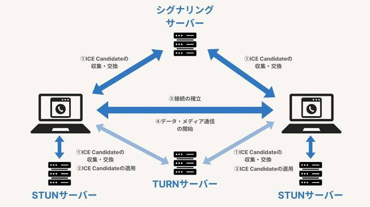
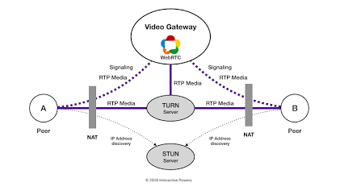
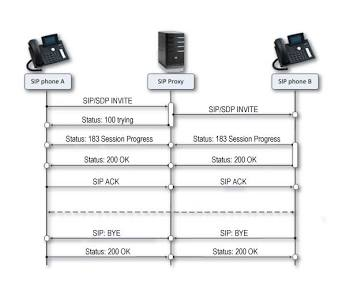

# voip_env

- 全てDockerで構築する
- Firebase Authで認証とユーザー管理を行う
- RealTime DatabaseでServer/Client側がお互いの情報を把握する

# 構成

## Client

それぞれでClient側を制作する。

### Web

検証が簡単なNext.jsなどで良い

### iOS

### Android

## Server

```sh
ipconfig getifaddr en0
```

でイントラネット上のIPアドレスを特定する。client側のモバイルはこのホストアドレスに書き換えること。

### WebRTC（シグナリングサーバー）

[発信者 (Peer A)]             [シグナリングサーバー]             [着信者 (Peer B)]
       │                                │                                │
       ├────── 1. INVITE ──────────────>│                                │
       │                                ├────── 1. INVITE ──────────────>│
       │                                │<───── 2. ACCEPT ──────────────┤
       │<───── 2. ACCEPT ───────────────┤                                │
       │                                │                                │
  (Offer作成)                           │                                │
       ├────── 3. OFFER ───────────────>│                                │
       │                                ├────── 3. OFFER ───────────────>│
       │                                │                          (Answer作成)
       │                                │<───── 4. ANSWER ──────────────┤
       │<───── 4. ANSWER ───────────────┤                                │
       │                                │                                │
 (ICE収集)                             │                            (ICE収集)
       ├────── 5. ICE CANDIDATE ───────>│                                │
       │                                ├────── 5. ICE CANDIDATE ───────>│
       │                                │<───── 5. ICE CANDIDATE ───────┤
       │<───── 5. ICE CANDIDATE ────────┤                                │
       │                                │                                │
       ===================================================================
                       P2Pメディア通信確立 (音声/映像)
       ===================================================================
       │                                │                                │
       ├────── 6. BYE ─────────────────>│                                │
       │                                ├────── 6. BYE ─────────────────>│

### SPD

Session Description Protocol

「自分自身がどんな通信を行えるか（利用するコーデック、IPアドレス、ポート番号など）」を記述して相手に伝えるためのテキストフォーマット

Offer / Answer（オファー / アンサー）モデル
SDP を使った条件交渉は、Offer / Answer と呼ばれるやり取りで行われます。

Offer（提案）の送信:
発信者（Peer A）が自分の対応しているすべてのコーデックやIP情報を記載した SDP（Offer）を作成し、相手に送信します。

Answer（回答）の返信:
着信者（Peer B）は Offer を受け取り、自分が対応できるものだけを絞り込んだ SDP（Answer）を作成して返します。

```
v=0
o=- 4611797823528256338 2 IN IP4 127.0.0.1
s=-
t=0 0
m=audio 54321 UDP/TLS/RTP/SAVPF 111 0 8
c=IN IP4 203.0.113.50
a=rtpmap:111 opus/48000/2
a=rtpmap:0 PCMU/8000
a=sendrecv
```

### STUN/TURNサーバー

#### STUN

Session Traversal Utilities for NAT
端末に自分自身のグローバルIPアドレスとポート番号を教える

1. クライアントがインターネット上の STUN サーバーにパケットを送る。
2. STUN サーバーはパケットの送信元を見て、「あなたのグローバルIPとポートは 203.0.113.10:50000 ですよ」と返答する。
3. クライアントはこのアドレス（反射アドレス / Server Reflexive Address）を通信相手に伝え、可能であれば端末同士で直接 P2P 通信を開始する。

#### TURN

Traversal Using Relays around NAT
P2P通信ができない場合に、すべての通信データを中継する

1. クライアントは TURN サーバーに接続要求を送り、サーバー上に中継用のアドレスを割り当ててもらう。
2. 相手端末へ送る音声や映像データはすべて一度 TURN サーバーへ送信される。
3. TURN サーバーがそのデータを相手端末へリレー（中継）する。


出典: NTTドコモビジネス


出典: Blog - Interactive Powers

### SIPサーバー

参考までに。
Session Initiation Protocol

#### シーケンス

1. 位置登録 (REGISTER)
端末A・Bが起動時、SIPサーバーへ「自分は内線101（IP: X）です」と登録します。

2. 発信・呼び出し (INVITE / 180 Ringing)
端末Aが「102に電話したい」とSIPサーバーに INVITE を送信。サーバーはDBを参照し、端末Bへ INVITE を転送します。端末Bの呼び出し音が鳴ると 180 Ringing が返ります。

3. 応答・確立 (200 OK / ACK)
端末Bが受話器を上げると 200 OK が返り、端末Aが ACK を返してセッションが確立します。

4. 音声通話 (RTP)
シグナリング完了後、音声パケット（RTP）はSIPサーバーを経由せず、端末Aと端末Bの間で直接 P2P 送受信されます（※NAT環境や録音等がある場合はサーバーを経由します）。

5. 切断 (BYE)
どちらかが電話を切ると BYE メッセージが送信され、通話セッションが終了します。


出典: Ozeki VoIP SIP SDK

## Firebase

- Firebase AuthでClientの認証とIDによるユーザー管理を行う
- RealTime Databaseでユーザー管理とどのユーザー同士で通信できるかを決める

```sh
brew update && brew install --cask gcloud-cli
dart pub global activate flutterfire_cli
gcloud auth login
gcloud projects list
gcloud config set project voip-env
gcloud config get-value project
firebase login
firebase projects:list
```

### RealTime Database

#### schema

設計判断の背景は`docs/adrs/202609262054-call-signaling-via-backend-api.md`と`docs/adrs/202609271801-call-room-schema-and-signaling-endpoints.md`を参照。

```jsonc
{
  "groups": {
    "group_101": {
      "members": { "uid_A": true, "uid_B": true }
    }
  },
  "users": {
    "uid_A": { "status": "busy" },
    "uid_B": {
      "status": "busy",
      // callee側のみ・通話中のみ存在。着信ダイアログ表示のトリガー
      // 「能動的に動いた側（caller）はAPIレスポンスで即座に情報を受け取れる」「受動的に待つ側（callee）だけが、自分の決まった場所を見張ることで誰からでも着信に気づける仕組みが要る」
      "incomingCall": { "roomId": "room_xyz123", "callerUid": "uid_A", "groupId": "group_101", "createdAt": 0 }
    }
  },
  "calls": {
    "room_xyz123": {
      "groupId": "group_101", "caller": "uid_A", "callee": "uid_B",
      "status": "calling",           // "calling" | "active" | "ended"
      "endedReason": null,           // "rejected" | "cancelled" | "hangup"（ended時のみ）
      "endedBy": null,               // 終了操作をしたuid（ended時のみ）
      "createdAt": 0, "answeredAt": null, "endedAt": null,
      "offer": { "sdp": "...", "createdAt": 0 },   // callerのみ書き込み可
      "answer": { "sdp": "...", "createdAt": 0 },  // calleeのみ書き込み可
      "iceCandidates": {
        "caller": { "-pushKey": { "candidate": "...", "sdpMid": "0", "sdpMLineIndex": 0, "createdAt": 0 } },
        "callee": { "-pushKey": { "...": "..." } }
      }
    }
  }
}
```

- `groups/{groupId}/members`: グループに属するuidの一覧。同じグループのユーザー同士のみ通話可能（`start` APIがチェック）
- `users/{uid}/status`: `online` / `busy`。`busy`の相手には新規発信できない
- `users/{uid}/incomingCall`: 着信通知。calleeが監視し、着信ダイアログの表示に使う
- `calls/{roomId}`: 通話セッション本体。`status`/`endedReason`/`endedBy`など管理フィールドは`start`/`accept`/`end` APIのみが書き込む（クライアントの直接書き込みは不可）。`offer`/`answer`/`iceCandidates`はcaller/callee本人がクライアントから直接書き込む（詳細は次項）

#### API（signaling server）

通話開始・応答・終了はクライアントの直接DB書き込みではなく、`signaling/`が提供するAPIを経由する。詳細は`signaling/README.md`を参照。

- `POST /api/calls/start`: 発信（グループ所属確認・busy判定・roomId発行・TURN資格情報発行）
- `POST /api/calls/[roomId]/accept`: 応答（`calling`→`active`）
- `POST /api/calls/[roomId]/end`: 終了（拒否/発信取消/通話終了のいずれもこの1本に集約。理由はサーバー側で導出）

Offer/Answer/ICE Candidateの交換はAPIを経由せず、発行された`roomId`を使ってクライアント同士が`calls/{roomId}`配下に直接読み書きする（セキュリティルールで境界を強制）。

#### rule

Realtime Databaseのセキュリティルールは`database.rules.json`（リポジトリルート）で管理する。`status`等の管理フィールドはAPI（Admin SDK）からのみ書き込み可能（クライアントの直接書き込みは不可）で、`offer`/`answer`/`iceCandidates`はcaller/callee本人のみ直接書き込みできる。デプロイ手順・Admin SDKのセットアップ手順は`signaling/README.md`を参照。

# 確認フロー

1. Aさん(yWo72LEq7TRiHRsPbfhzDh9Bzd13)からBさん(suyMIoEvFOVy2bBYvWhw4KZSQ753)にflutterアプリで"テスト発信(start call)""をタップする
2. RealTime Databaseが書き換わっていることを確認する

```sh

# ユーザーのstatusを確認
firebase database:get /users --project=voip-env --pretty

# roomを削除
firebase database:remove /calls --project=voip-env -f

# busyのままなら手動でonlineへ戻す（本来はendCallで自動的に行われる）
firebase database:set /users/yWo72LEq7TRiHRsPbfhzDh9Bzd13/status -d '"online"' --project=voip-env -f
firebase database:set /users/suyMIoEvFOVy2bBYvWhw4KZSQ753/status -d '"online"' --project=voip-env -f
# callee側のincomingCallを削除
firebase database:remove /users/suyMIoEvFOVy2bBYvWhw4KZSQ753/incomingCall --project=voip-env -f
```
